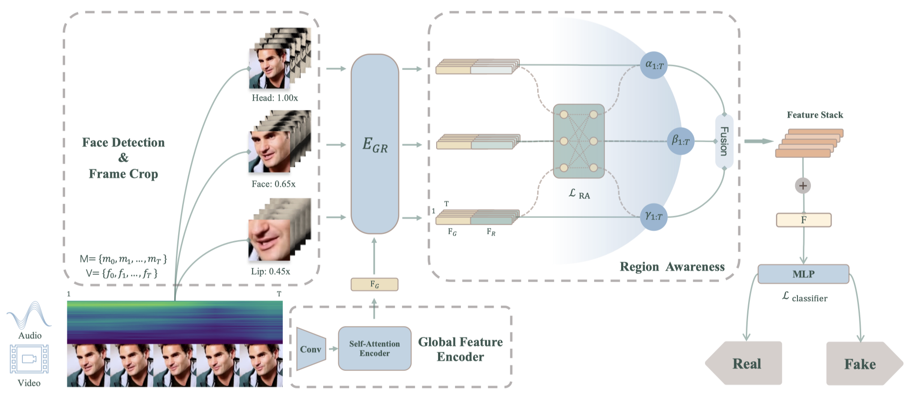
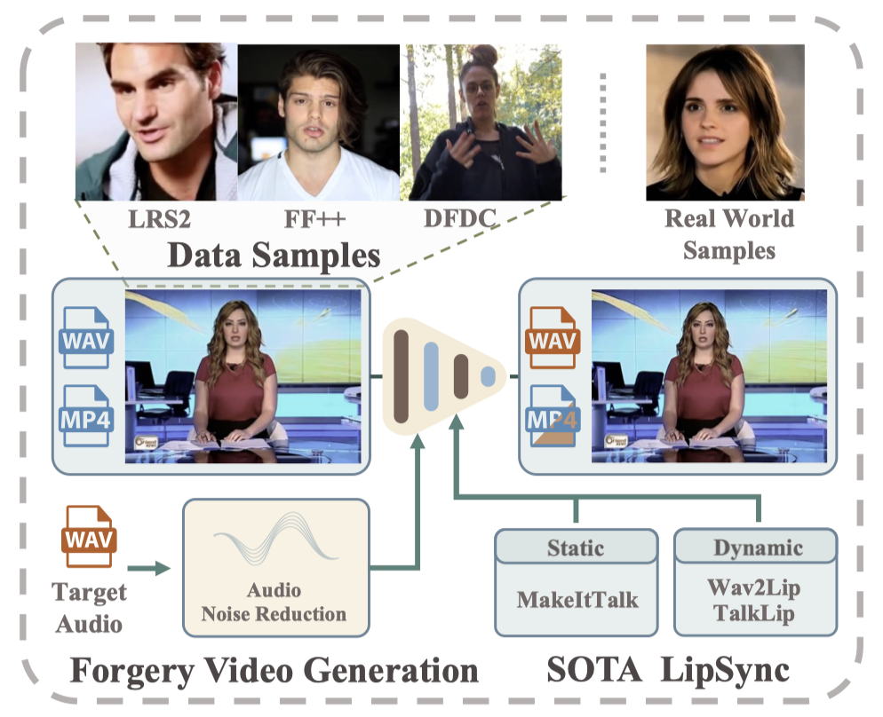

# [NeruIPS 2024] Lips Are Lying: Spotting the Temporal Inconsistency between Audio and Visual in Lip-syncing DeepFakes

   
    

This repository contains the codes of "Lips Are Lying: Spotting the Temporal Inconsistency between Audio and Visual in Lip-syncing DeepFakes".

> **Abstract.**  In recent years, DeepFake technology has achieved unprecedented success in high-quality video synthesis, but these methods also pose potential and severe security threats to humanity. DeepFake can be bifurcated into entertainment applications like face swapping and illicit uses such as lip-syncing fraud. However, lip-forgery videos, which neither change identity nor have discernible visual artifacts, present a formidable challenge to existing DeepFake detection methods. Our preliminary experiments have shown that the effectiveness of the existing methods often drastically decrease or even fail when tackling lip-syncing videos.
> In this paper, for the first time, we propose a novel approach dedicated to lip-forgery identification that exploits the inconsistency between lip movements and audio signals. We also mimic human natural cognition by capturing subtle biological links between lips and head regions to boost accuracy. To better illustrate the effectiveness and advances of our proposed method, we create a high-quality LipSync dataset, AVLips, by employing the state-of-the-art lip generators. We hope this high-quality and diverse dataset could be well served the further research on this challenging and interesting field. Experimental results show that our approach gives an average accuracy of more than 95.3% in spotting lip-syncing videos, significantly outperforming the baselines. Extensive experiments demonstrate the capability to tackle deepfakes and the robustness in surviving diverse input transformations. Our method achieves an accuracy of up to 90.2% in real-world scenarios (e.g., WeChat video call) and shows its powerful capabilities in real scenario deployment.

## AVLips: A high-quality audio-visual dataset for lipsync detection

To the best of our knowledge, the majority of public DeepFake datasets consist solely of videos or images, with no specialized one specifically dedicated to LipSync detection available. To fill this gap, we construct a high-quality **A**udio-**V**isual **Lip**-syncing Dataset, **AVLips**, which contains up to 340,000 audio-visual samples generated by several SOTA LipSync methods. The workflow is demonstrated below.

**High quality.** We employed a combination of static MakeItTalk and dynamic Wav2Lip, TalkLip, SadTalker generation methods to simulate realistic lip movements. These methods are widely recognized as high-quality work, capable of generating high-resolution videos while ensuring accurate lip movements. We applied a noise reduction algorithm to all audio samples before synthesis to reduce irrelevant background noise, ensuring the models can focus on speech content. 

**Diversity.** Our dataset encompasses a wide range of scenarios, covering not only well-known public datasets but also real-world data. Our aim is for this collection to act as a catalyst for advancing real-time forgery detection. To better simulate the nuances of real-world conditions, we have employed six perturbation techniques — saturation, contrast, compression, Gaussian noise, Gaussian blur, and pixelation — at various degrees, thus ensuring the dataset's realism and practical relevance.

**Download Link: [AVLips v1.0](https://drive.google.com/file/d/1fEiUo22GBSnWD7nfEwDW86Eiza-pOEJm/view?usp=share_link)**

**News:** The AVLips v2.0 is coming soon! (MORE forgery methods and data.)

## Requirements

~~~bash
conda create -n LipFD python==3.10
conda activate LipFD
pip install -r requirements.txt
~~~

## Dataset Preprocess

**You can skip this section, if you only want to perform validation.**

Download AVLips dataset and put it in the root directory. 

AVLips dataset folder structure.

~~~
AVLips
├── 0_real
│   ├── 0.mp4
│    ...
├── 1_fake
│   ├── 0.mp4
│   └── ...
└── wav
    ├── 0_real
    │   ├── 0.wav
    │   └── ...
    └── 1_fake
        ├── 0.wav
        └── ...
~~~

Preprocess the dataset for training. 

~~~bash
python preprocess.py
~~~

Preprocessed AVLips dataset folder structure.

~~~bash
datasets
└── AVLips
    ├── 0_real
    │   ├── 0_0.png
    │   └── ...
    └── 1_fake
        ├── 0_0.png
        └── ...
~~~

The data sample is showed as follow, and **the fully processed dataset is approximately 60 GB.**

## Validation

- Download our [pertained weights](https://drive.google.com/file/d/1NPAcx0QS8N9v_9qUr-51jBaL9kGDT-cp/view?usp=share_link) and save it in to `checkpoints/ckpt.pth`. 

- Download [validation set](https://drive.google.com/file/d/1gZjzps5_rbr6CeBqBke8l2Gs8xXx_Ctb/view?usp=share_link) and extract it into `datasets/val`.

~~~bash
python validate.py --real_list_path ./datasets/val/0_real --fake_list_path ./datasets/val/1_fake --ckpt ./checkpoints/ckpt.pth
~~~

## Train

First, edit `--fake_list_path` and `--real_list_path`  in `options/base_options.py`.

Then, run `python train.py`.

## Citation

If you find this repo useful for your research, please consider citing our work:

~~~
@article{liu2024lips,
  title={Lips Are Lying: Spotting the Temporal Inconsistency between Audio and Visual in Lip-Syncing DeepFakes},
  author={Liu, Weifeng and She, Tianyi and Liu, Jiawei and Wang, Run and Yao, Dongyu and Liang, Ziyou},
  journal={arXiv preprint arXiv:2401.15668},
  year={2024}
}
~~~